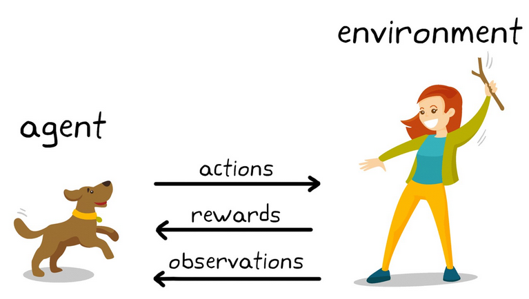

# snake-like-game-ai-reinforcement

Info: This game is not snake game. The goal is to apply reinforcement techniques to teach the player to detect the position of food and get it. AI for real snake game will be programmed later on.

## Introduction
AI for snake-like game trained from the states of environment using Neural Network. Neural Network is implemented using [Keras](https://keras.io/) functional API, that makes it easy to experiment with different architectures. The input of Neural Network is the state elements of our environment.   We have 4 states in this game:

* Player position over x-axis
* Player position over y-axis
* Food position over x-axis
* Food position over y-axis

## Data
Data has always been one of the most important things in AI related problems. In order to teach the player to make an action in each state, data should be well gathered. In order to have a good data I did not play the game randomly but with user-handling keyboard. So I played the game for about 300 episodes, gave the reward when player eats food and gathered data.  

## Model

Neural Network input is consist of 4 neurons, which are showed above. Since we have 4 choices in each state (up, down, left, right), the number of output neurons is 4. The architecture of the neural network is not complex, I tried with two hidden layers but you can experiment with other architectures.

